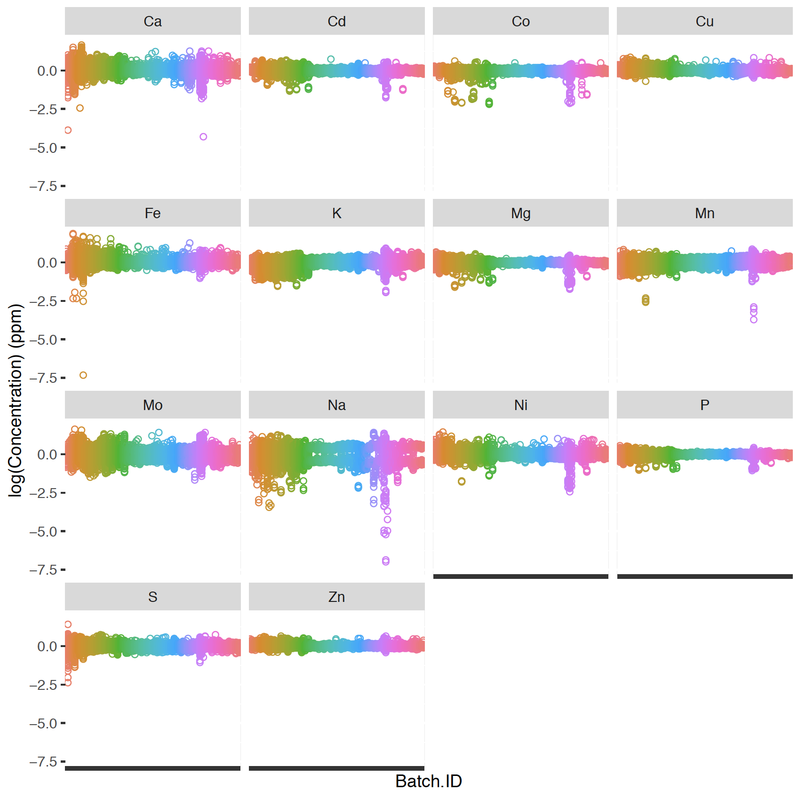
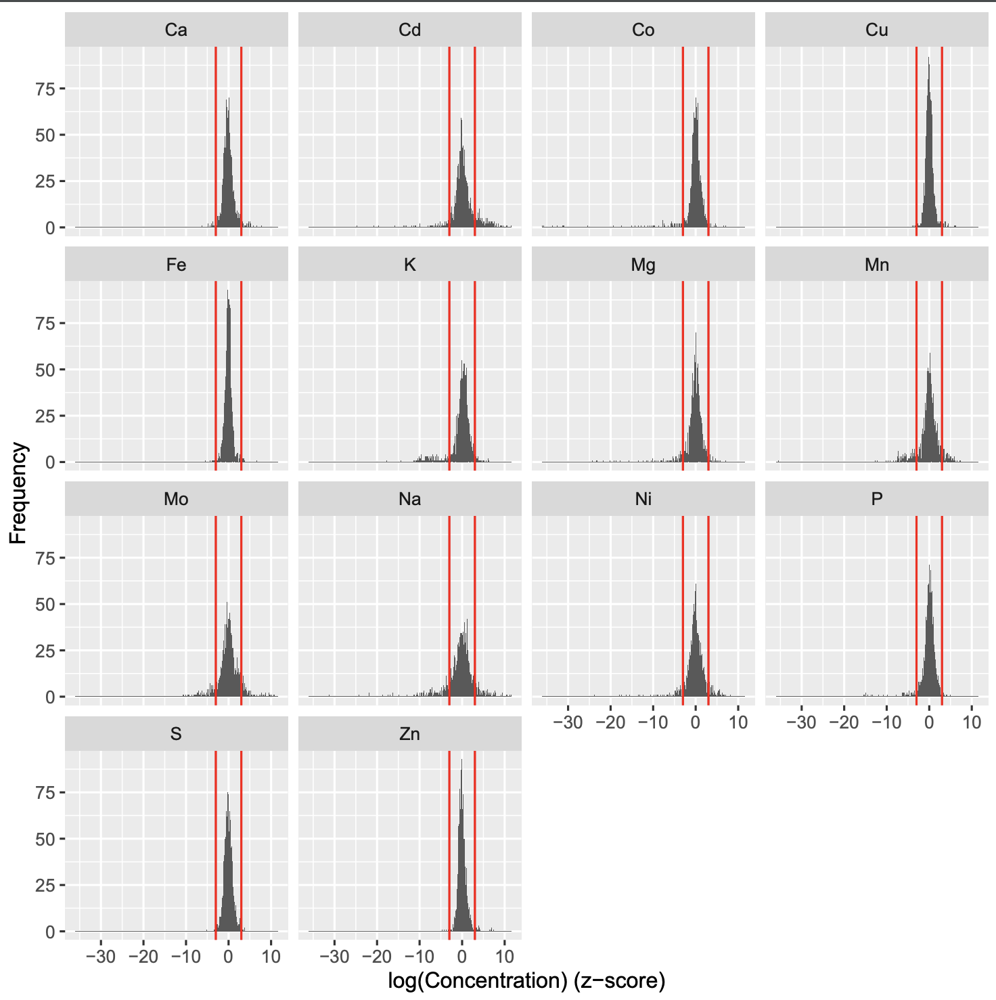

# MetaboFlow
This pipeline describes the processing and the analysis of Ionomics data. 
This [paper](https://arxiv.org/abs/1910.14191) describes a possible application.

The workflow consist of four sections, and respectively

* Pre-processing
* Exploratory analysis
* Clustering which also includes the GO Slim annotation and the GO terms enrichment
* Network analysis

The pre-processing section is required as first as it produces the cleaned dataset used in the other sections. There is no specific order on how to run the other three sections. 

## Section 1: Pre-processing
This first section aims to free the data from unreliable samples which will probably lead to wrong outputs. In such way, effective data pre-processing methods are applied to avoid the effects of noisy and unreliable data.

This section requires as input the raw data frame, e.g. ion's concentrations. It is also possible to define a set of ion's standard deviation, as these are possibly computed accounting for some control genes. Note that the latter is an optional input i.e if not provided the standard deviations from the data would be computed to perform the data standardisation (see Section [Standardisation](https://github.com/AlinaPeluso/MetaboFlow#standardisation)).


```
# Import data
Idata <- read.csv('./Data/Dataset_Metaboflow_Ionomic_Workflow.csv',header=T)
pre_defined_sd <- read.table('./Data/pre_defined_sd.txt', header=T)

# Execute pre-processing fn
source("./R_fn/PreProcessing_fn.R")
fn1 <- PreProcessing(data=Idata,stdev=pre_defined_sd)
```

#### Inspect the imported raw data

We illustrate the Ionomics workflow with ICP-MS data of yeast intracellular ion concentrations measured for 1454 single-gene haploid knockouts [see @danku2009high]. Ions measured include Ca44, Cd111, Co59, Cu65, Fe56, K39, Mg25, Mn55, Mo95, Na23, Ni60, P31, S34, Zn66. Values of concentration are in ppm and have been adjusted using optical density measurements. Intracellular concentrations are measured for two, four or eight replicas of each mutant depending on the knock-out. Knock-out YDL227C mutant is measured multiple times in every batch as control strain.

The concentration values for the raw data ion can be summarised as follow.

```
fn1$stats.raw_data
```

|    | Ion | Min       | 1st Quartile | Median    | Mean      | 3rd Quartile | Max        | Variance    |
|----|-----|-----------|--------------|-----------|-----------|--------------|------------|-------------|
| 1  | Ca  | 0\.449    | 31\.73       | 40\.44    | 45\.071   | 51\.015      | 902\.568   | 829\.525    |
| 2  | Cd  | 0\.174    | 0\.866       | 0\.988    | 1\.002    | 1\.121       | 2\.512     | 0\.051      |
| 3  | Co  | 0\.007    | 0\.142       | 0\.16     | 0\.162    | 0\.184       | 0\.702     | 0\.001      |
| 4  | Cu  | 0\.587    | 1\.344       | 1\.586    | 1\.717    | 1\.831       | 327\.79    | 16\.91      |
| 5  | Fe  | 0\.002    | 5\.527       | 7\.295    | 9\.469    | 9\.332       | 6624\.526  | 5154\.611   |
| 6  | K   | 284\.273  | 2060\.619    | 2495\.265 | 2492\.765 | 2879\.551    | 17777\.452 | 534784\.375 |
| 7  | Mg  | 115\.63   | 546\.325     | 679\.275  | 642\.578  | 753\.678     | 3838\.479  | 31947\.598  |
| 8  | Mn  | 0\.02     | 0\.982       | 1\.206    | 1\.197    | 1\.38        | 7\.339     | 0\.106      |
| 9  | Mo  | 0\.158    | 0\.656       | 0\.934    | 1\.109    | 1\.327       | 60\.879    | 1\.855      |
| 10 | Na  | 0\.184    | 128\.831     | 185\.25   | 196\.545  | 247\.747     | 892\.968   | 9027\.944   |
| 11 | Ni  | 0\.074    | 0\.982       | 1\.258    | 1\.693    | 1\.543       | 2323\.058  | 565\.618    |
| 12 | P   | 1194\.953 | 3833\.9      | 4514\.476 | 4289\.109 | 4952\.98     | 21695\.748 | 1151197\.05 |
| 13 | S   | 20\.592   | 434\.61      | 512\.845  | 529\.493  | 605\.436     | 5484\.638  | 37212\.137  |
| 14 | Zn  | 7\.659    | 14\.785      | 16\.549   | 17\.114   | 18\.334      | 2221\.586  | 511\.804    |


There is a very high variability of the knockouts across ions and within the batches.
There are no missing values in the data.


#### Outlier detection

We define a lower outer fence: `$Q1 - 3*IQ$` and a upper outer fence: `$Q3 + 3*IQ$` where `$Q1$` and `$Q3$` are the first and the third quantile of the distribution, respectively. A point beyond the outer fence is considered an extreme outlier.

The outliers are split across ions as follows. 

```
fn1$stats.outliers
```
| Ion | no | outlier | outlier | outlier\(%\) |
|-----|----|---------|---------|--------------|
| 1   | Ca | 9694    | 305     | 0\.22        |
| 2   | Cd | 9950    | 49      | 0\.04        |
| 3   | Co | 9966    | 33      | 0\.02        |
| 4   | Cu | 9870    | 129     | 0\.09        |
| 5   | Fe | 9833    | 166     | 0\.12        |
| 6   | K  | 9980    | 19      | 0\.01        |
| 7   | Mg | 9991    | 8       | 0\.01        |
| 8   | Mn | 9984    | 15      | 0\.01        |
| 9   | Mo | 9909    | 90      | 0\.06        |
| 10  | Na | 9965    | 34      | 0\.02        |
| 11  | Ni | 9849    | 150     | 0\.11        |
| 12  | P  | 9991    | 8       | 0\.01        |
| 13  | S  | 9923    | 76      | 0\.05        |
| 14  | Zn | 9888    | 111     | 0\.08        |


#### Median batch correction

First we take the logarithmm of the concentration value. Then, the data are scaled to the median taken for each ion within each batch.

```
fn1$stats.median_batch_corrected_data
```
|    | Ion | Min      | 1st Quartile | Median | Mean     | 3rd Quartile | Max    | Variance |
|----|-----|----------|--------------|--------|----------|--------------|--------|----------|
| 1  | Ca  | \-4\.311 | \-0\.124     | 0      | 0\.022   | 0\.148       | 1\.671 | 0\.084   |
| 2  | Cd  | \-1\.749 | \-0\.068     | 0      | 0\.001   | 0\.068       | 0\.735 | 0\.025   |
| 3  | Co  | \-2\.178 | \-0\.059     | 0      | \-0\.02  | 0\.054       | 0\.629 | 0\.033   |
| 4  | Cu  | \-0\.681 | \-0\.055     | 0      | 0\.009   | 0\.06        | 0\.876 | 0\.013   |
| 5  | Fe  | \-7\.332 | \-0\.1       | 0      | 0\.017   | 0\.115       | 1\.869 | 0\.062   |
| 6  | K   | \-1\.96  | \-0\.124     | 0      | \-0\.044 | 0\.1         | 0\.938 | 0\.068   |
| 7  | Mg  | \-1\.735 | \-0\.061     | 0      | \-0\.016 | 0\.059       | 0\.688 | 0\.03    |
| 8  | Mn  | \-3\.71  | \-0\.125     | 0      | \-0\.023 | 0\.101       | 0\.856 | 0\.052   |
| 9  | Mo  | \-1\.662 | \-0\.163     | 0      | \-0\.003 | 0\.169       | 1\.623 | 0\.103   |
| 10 | Na  | \-6\.992 | \-0\.26      | 0      | \-0\.058 | 0\.189       | 1\.403 | 0\.216   |
| 11 | Ni  | \-2\.422 | \-0\.094     | 0      | 0\.006   | 0\.104       | 1\.443 | 0\.057   |
| 12 | P   | \-1\.059 | \-0\.054     | 0      | \-0\.009 | 0\.052       | 0\.571 | 0\.017   |
| 13 | S   | \-2\.384 | \-0\.086     | 0      | \-0\.002 | 0\.091       | 1\.411 | 0\.034   |
| 14 | Zn  | \-0\.416 | \-0\.046     | 0      | 0\.011   | 0\.054       | 0\.661 | 0\.009   |

After outlier removal and the median batch correction of the logged concentrations (logConcentration_corr), the data looks as

```
fn1$plot.logConcentration_by_batch 
```


#### Standardisation

After outlier removal and median batch correction we now standardise the ions' logged concentrations. For each set of knockouts across the ions's type, we normalise the concentrations by dividing for the ions' standard deviation. The ions' standard deviations can be estimated from the data, or a set of pre-defined ions' standard deviations can be used. The latter has been computed on the complete dataset (which includes also some gene controls). At the moment we do not use the pre-defined ion's concenrations to normalise our data.


The concentration values for each ion can be summarised as follow.

```
fn1$stats.standardised_data
```


|    | Ion | Min       | 1st Quartile | Median   | Mean     | 3rd Quartile | Max     | Variance |
|----|-----|-----------|--------------|----------|----------|--------------|---------|----------|
| 1  | Ca  | \-4\.135  | \-1\.937     | 0\.057   | 0\.945   | 3\.187       | 10\.698 | 15\.266  |
| 2  | Cd  | \-2\.894  | \-0\.341     | 0\.596   | 0\.558   | 1\.257       | 4\.214  | 2\.111   |
| 3  | Co  | \-1\.863  | \-0\.383     | 0\.167   | 0\.568   | 1\.371       | 4\.942  | 2\.629   |
| 4  | Cu  | \-1\.126  | \-0\.643     | \-0\.363 | 0\.318   | 0\.944       | 4\.662  | 2\.012   |
| 5  | Fe  | \-1\.789  | \-0\.733     | \-0\.48  | \-0\.263 | \-0\.006     | 2\.043  | 0\.724   |
| 6  | K   | \-2\.099  | \-0\.734     | 0\.005   | 0\.285   | 0\.818       | 5\.242  | 2\.307   |
| 7  | Mg  | \-12\.918 | \-1\.082     | 0\.608   | 0\.236   | 2\.425       | 9\.631  | 12\.37   |
| 8  | Mn  | \-1\.85   | \-0\.377     | 0\.93    | 0\.917   | 2\.06        | 4\.133  | 2\.39    |
| 9  | Mo  | \-5\.016  | \-0\.672     | 1\.354   | 1\.522   | 3\.409       | 11\.099 | 10\.04   |
| 10 | Na  | \-4\.029  | \-1\.121     | \-0\.156 | \-0\.242 | 0\.458       | 3\.238  | 1\.791   |
| 11 | Ni  | \-1\.476  | \-0\.414     | 0\.454   | 0\.549   | 1\.009       | 6\.043  | 1\.918   |
| 12 | P   | \-3\.697  | \-1\.269     | \-0\.115 | \-0\.179 | 0\.724       | 3\.667  | 2\.441   |
| 13 | S   | \-1\.345  | \-0\.396     | 0\.283   | 0\.309   | 0\.767       | 4\.961  | 1\.103   |
| 14 | Zn  | \-1\.969  | \-0\.773     | \-0\.476 | \-0\.096 | 0\.44        | 4\.263  | 1\.304   |


#### Symbolization
As we are working with the logConcentration_corr_norm we can consider a thresold based on a certain number of sigma (e.g. number-of-sigma thresold=3) to symbolizise the concentrations' profile of the knockouts as follow:

* Symb=0  if -3<logConcentration_corr_norm<3 
* Symb=1  if logConcentration_corr_norm>=3 
* Symb=-1 otherwise

The choice of the thresold is arbitrary i.e. thresold greater than 3 can be chosen. The highest is the thresold, the highest is the concentration value taken as significant.


#### Aggregation of the knockout replicates

For each ion measure, we proceed to aggregate the data by taking the median value of the knockout. For each ions we consider around 1,450 genes. And of which we can plot the z-score with the associated sigma as follow.

```
fn1$plot.logConcentration_z_scores
```



#### Final dataset

Three dataset are obtained as output. The first in the long format (genes as rows and ions as columns), and two in wide format and respectively one with the standardised ion's concentraction, and the other with the symbolised profiles of the knockouts.

Long format (aggregated knockout replicates):
```
dataR.long <- fn1$dataR.long
head(dataR.long)
```
| row\_id | Knockout | Batch\_ID | id   | Ion | Concentration | Outlier | logConcentration | logConcentration\_corr | logConcentration\_corr\_norm | Symb |
|---------|----------|-----------|------|-----|---------------|---------|------------------|------------------------|------------------------------|------|
| 3851    | YAL002W  | 19        | 3851 | Ca  | 93\.4         | 0       | 4\.54            | 0\.96                  | 6\.3                         | 1    |
| 3852    | YAL002W  | 19        | 3852 | Ca  | 98\.2         | 0       | 4\.59            | 1\.01                  | 6\.7                         | 1    |
| 3853    | YAL002W  | 19        | 3853 | Ca  | 101\.6        | 0       | 4\.62            | 1\.04                  | 6\.9                         | 1    |
| 13850   | YAL002W  | 19        | 3851 | Cd  | 1\.5          | 0       | 0\.42            | 0\.5                   | 8\.8                         | 1    |
| 13851   | YAL002W  | 19        | 3852 | Cd  | 1\.6          | 0       | 0\.45            | 0\.53                  | 9\.2                         | 1    |
| 13852   | YAL002W  | 19        | 3853 | Cd  | 1\.6          | 0       | 0\.5             | 0\.58                  | 10\.1                        | 1    |


Long format (not aggregated knockout replicates):
```
data.long <- fn1$data.long
head(data.long)
```
| Knockout | Ion | logConcentration\_corr\_norm | Symb |
|----------|-----|------------------------------|------|
| YAL002W  | Ca  | 6\.68                        | 1    |
| YAL004W  | Ca  | \-0\.88                      | 0    |
| YAL005C  | Ca  | \-0\.15                      | 0    |
| YAL007C  | Ca  | \-0\.54                      | 0    |
| YAL008W  | Ca  | \-0\.88                      | 0    |
| YAL009W  | Ca  | \-0\.95                      | 0    |


Wide format, standardised ion's concentraction:
```
data.wide <- fn1$data.wide
head(data.wide)
```
| Knockout | Ca      | Cd      | Co       | Cu      | Fe       | K       | Mg        | Mn      | Mo     | Na      | Ni      | P       | S       | Zn       |
|----------|---------|---------|----------|---------|----------|---------|-----------|---------|--------|---------|---------|---------|---------|----------|
| YAL002W  | 6\.68   | 9\.64   | 0\.296   | 0\.65   | \-0\.056 | \-3\.56 | \-1\.3357 | 5\.37   | \-2\.7 | 3\.94   | \-3\.73 | 0\.94   | \-1\.24 | 0\.472   |
| YAL004W  | \-0\.88 | 0\.9    | 0\.882   | \-0\.59 | 1\.017   | 0\.76   | 1\.5433   | \-2\.45 | 0\.81  | \-0\.13 | 0\.94   | 0\.83   | 0\.52   | 0\.073   |
| YAL005C  | \-0\.15 | \-0\.13 | 0\.278   | 0\.94   | \-0\.638 | 1\.3    | 0\.809    | \-1\.33 | \-0\.4 | 1\.79   | 0\.88   | 0\.27   | \-0\.13 | \-0\.081 |
| YAL007C  | \-0\.54 | \-0\.2  | \-0\.649 | \-0\.59 | 0\.803   | 1\.41   | \-0\.6495 | 1\.42   | 3\.24  | \-0\.35 | \-0\.68 | 0\.29   | \-0\.58 | \-0\.424 |
| YAL008W  | \-0\.88 | \-0\.56 | \-0\.416 | \-1\.3  | \-0\.545 | 0\.32   | \-0\.5299 | 0\.34   | 1\.9   | 0\.13   | \-0\.65 | \-0\.34 | \-0\.83 | \-0\.666 |
| YAL009W  | \-0\.95 | 0\.91   | \-0\.016 | \-0\.84 | \-1\.134 | 0\.18   | 0\.0087   | 1\.06   | 4\.91  | 0\.74   | \-0\.84 | 0\.11   | 0\.17   | \-0\.884 |


Wide format, symbolised profiles:
```
data.wide_Symb <- fn1$data.wide_Symb
head(data.wide_Symb)
```
| Knockout | Ca | Cd | Co | Cu | Fe | K   | Mg | Mn | Mo | Na | Ni  | P | S | Zn |
|----------|----|----|----|----|----|-----|----|----|----|----|-----|---|---|----|
| YAL002W  | 1  | 1  | 0  | 0  | 0  | \-1 | 0  | 1  | 0  | 1  | \-1 | 0 | 0 | 0  |
| YAL004W  | 0  | 0  | 0  | 0  | 0  | 0   | 0  | 0  | 0  | 0  | 0   | 0 | 0 | 0  |
| YAL005C  | 0  | 0  | 0  | 0  | 0  | 0   | 0  | 0  | 0  | 0  | 0   | 0 | 0 | 0  |
| YAL007C  | 0  | 0  | 0  | 0  | 0  | 0   | 0  | 0  | 1  | 0  | 0   | 0 | 0 | 0  |
| YAL008W  | 0  | 0  | 0  | 0  | 0  | 0   | 0  | 0  | 0  | 0  | 0   | 0 | 0 | 0  |
| YAL009W  | 0  | 0  | 0  | 0  | 0  | 0   | 0  | 0  | 1  | 0  | 0   | 0 | 0 | 0  |


