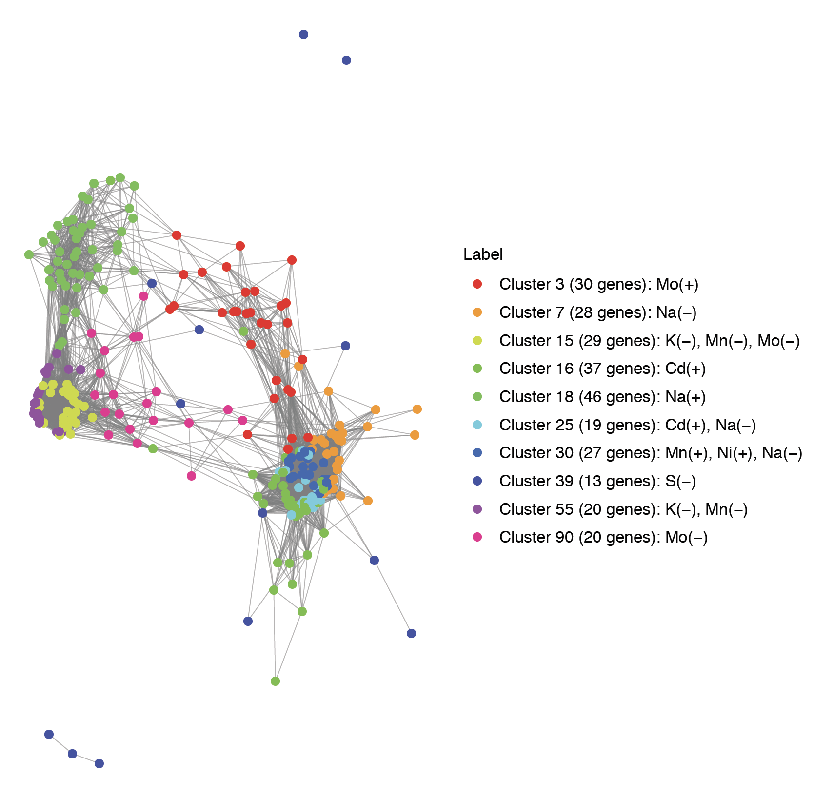

# MetaboFlow - the development of standardised workflows for processing metabolomics data to aid reproducible data sharing and big data initiatives

This pipeline describes the processing and the analysis of Ionomics data. 
This [paper](https://arxiv.org/abs/1910.14191) describes a possible application.

The workflow is wrapped within the `r IonFlow` R package, and it consists of four sections, respectively

* Pre-processing
* Exploratory analysis
* Clustering which also includes the GO Slim annotation and the GO terms enrichment
* Network analysis

```
# Import the package
devtools::install_github("AlinaPeluso/MetaboFlow", subdir="IonFlow")
library(IonFlow)
```

## Section 1: Pre-processing
The pre-processing section is required first as it produces in output the cleaned dataset to be used in the other sections. There is no specific order on how to run the other sections. 

The pre-processing section aims to free the data from unreliable samples which will probably lead to wrong outputs. In such way, effective data pre-processing methods are applied to avoid the effects of noisy and unreliable data.

This section requires as input the raw data frame, e.g. ion's concentrations. It is also possible to define a set of ion's standard deviation, as these are possibly computed accounting for some control genes. Note that the latter is an optional input i.e if not provided the standard deviations from the data would be computed to perform the data standardisation (see Section [Standardisation](https://github.com/AlinaPeluso/MetaboFlow#standardisation)).


#### Inspect the raw data

```{r, echo=FALSE}
data(IonData)
```

We illustrate the Ionomics workflow with ICP-MS data of yeast intracellular ion concentrations measured for 1454 single-gene haploid knockouts (data from [Danku, 2009](https://abdn.pure.elsevier.com/en/publications/a-high-throughput-method-for-saccharomyces-cerevisiae-yeast-ionom)). Ions measured include Ca44, Cd111, Co59, Cu65, Fe56, K39, Mg25, Mn55, Mo95, Na23, Ni60, P31, S34, Zn66. Values of concentration are in ppm and have been adjusted using optical density measurements. Intracellular concentrations are measured for two, four or eight replicas of each mutant depending on the knock-out. Knock-out YDL227C mutant is measured multiple times in every batch as control strain.

#### Run the pre-processing function

```
# Run pre-processing function
pre_proc <- PreProcessing(data=IonData,stdev=pre_defined_sd)
```

The concentration values for the raw data ion can be summarised as follow.

```
pre_proc$stats.raw_data
```

|    | Ion | Min       | 1st Quartile | Median    | Mean      | 3rd Quartile | Max        | Variance    |
|----|-----|-----------|--------------|-----------|-----------|--------------|------------|-------------|
| 1  | Ca  | 0\.449    | 31\.73       | 40\.44    | 45\.071   | 51\.015      | 902\.568   | 829\.525    |
| 2  | Cd  | 0\.174    | 0\.866       | 0\.988    | 1\.002    | 1\.121       | 2\.512     | 0\.051      |
| 3  | Co  | 0\.007    | 0\.142       | 0\.16     | 0\.162    | 0\.184       | 0\.702     | 0\.001      |
| 4  | Cu  | 0\.587    | 1\.344       | 1\.586    | 1\.717    | 1\.831       | 327\.79    | 16\.91      |
| 5  | Fe  | 0\.002    | 5\.527       | 7\.295    | 9\.469    | 9\.332       | 6624\.526  | 5154\.611   |
| 6  | K   | 284\.273  | 2060\.619    | 2495\.265 | 2492\.765 | 2879\.551    | 17777\.452 | 534784\.375 |
| 7  | Mg  | 115\.63   | 546\.325     | 679\.275  | 642\.578  | 753\.678     | 3838\.479  | 31947\.598  |
| 8  | Mn  | 0\.02     | 0\.982       | 1\.206    | 1\.197    | 1\.38        | 7\.339     | 0\.106      |
| 9  | Mo  | 0\.158    | 0\.656       | 0\.934    | 1\.109    | 1\.327       | 60\.879    | 1\.855      |
| 10 | Na  | 0\.184    | 128\.831     | 185\.25   | 196\.545  | 247\.747     | 892\.968   | 9027\.944   |
| 11 | Ni  | 0\.074    | 0\.982       | 1\.258    | 1\.693    | 1\.543       | 2323\.058  | 565\.618    |
| 12 | P   | 1194\.953 | 3833\.9      | 4514\.476 | 4289\.109 | 4952\.98     | 21695\.748 | 1151197\.05 |
| 13 | S   | 20\.592   | 434\.61      | 512\.845  | 529\.493  | 605\.436     | 5484\.638  | 37212\.137  |
| 14 | Zn  | 7\.659    | 14\.785      | 16\.549   | 17\.114   | 18\.334      | 2221\.586  | 511\.804    |


There is a very high variability of the knockouts across ions and within the batches.
There are no missing values in the data.


#### Outlier detection

We define a lower outer fence: `Q1 - 3*IQ` and a upper outer fence: `Q3 + 3*IQ` where `Q1` and `Q3` are the first and the third quantile of the distribution, respectively. A point beyond the outer fence is considered an extreme outlier.

The outliers are split across ions as follows. 

```
pre_proc$stats.outliers
```
|     |Ion | not\_outlier | outlier | outlier\(%\) |
|-----|----|--------------|---------|--------------|
| 1   | Ca | 9694         | 305     | 0\.22        |
| 2   | Cd | 9950         | 49      | 0\.04        |
| 3   | Co | 9966         | 33      | 0\.02        |
| 4   | Cu | 9870         | 129     | 0\.09        |
| 5   | Fe | 9833         | 166     | 0\.12        |
| 6   | K  | 9980         | 19      | 0\.01        |
| 7   | Mg | 9991         | 8       | 0\.01        |
| 8   | Mn | 9984         | 15      | 0\.01        |
| 9   | Mo | 9909         | 90      | 0\.06        |
| 10  | Na | 9965         | 34      | 0\.02        |
| 11  | Ni | 9849         | 150     | 0\.11        |
| 12  | P  | 9991         | 8       | 0\.01        |
| 13  | S  | 9923         | 76      | 0\.05        |
| 14  | Zn | 9888         | 111     | 0\.08        |


#### Median batch correction

First we take the logarithmm of the concentration value. Then, the data are scaled to the median taken for each ion within each batch.

```
pre_proc$stats.median_batch_corrected_data
```
|    | Ion | Min      | 1st Quartile | Median | Mean     | 3rd Quartile | Max    | Variance |
|----|-----|----------|--------------|--------|----------|--------------|--------|----------|
| 1  | Ca  | \-4\.311 | \-0\.124     | 0      | 0\.022   | 0\.148       | 1\.671 | 0\.084   |
| 2  | Cd  | \-1\.749 | \-0\.068     | 0      | 0\.001   | 0\.068       | 0\.735 | 0\.025   |
| 3  | Co  | \-2\.178 | \-0\.059     | 0      | \-0\.02  | 0\.054       | 0\.629 | 0\.033   |
| 4  | Cu  | \-0\.681 | \-0\.055     | 0      | 0\.009   | 0\.06        | 0\.876 | 0\.013   |
| 5  | Fe  | \-7\.332 | \-0\.1       | 0      | 0\.017   | 0\.115       | 1\.869 | 0\.062   |
| 6  | K   | \-1\.96  | \-0\.124     | 0      | \-0\.044 | 0\.1         | 0\.938 | 0\.068   |
| 7  | Mg  | \-1\.735 | \-0\.061     | 0      | \-0\.016 | 0\.059       | 0\.688 | 0\.03    |
| 8  | Mn  | \-3\.71  | \-0\.125     | 0      | \-0\.023 | 0\.101       | 0\.856 | 0\.052   |
| 9  | Mo  | \-1\.662 | \-0\.163     | 0      | \-0\.003 | 0\.169       | 1\.623 | 0\.103   |
| 10 | Na  | \-6\.992 | \-0\.26      | 0      | \-0\.058 | 0\.189       | 1\.403 | 0\.216   |
| 11 | Ni  | \-2\.422 | \-0\.094     | 0      | 0\.006   | 0\.104       | 1\.443 | 0\.057   |
| 12 | P   | \-1\.059 | \-0\.054     | 0      | \-0\.009 | 0\.052       | 0\.571 | 0\.017   |
| 13 | S   | \-2\.384 | \-0\.086     | 0      | \-0\.002 | 0\.091       | 1\.411 | 0\.034   |
| 14 | Zn  | \-0\.416 | \-0\.046     | 0      | 0\.011   | 0\.054       | 0\.661 | 0\.009   |

After outlier removal and the median batch correction of the logged concentrations (logConcentration_corr), the data looks as

```
pre_proc$plot.logConcentration_by_batch 
```


#### Standardisation

After outlier removal and median batch correction we now standardise the ions' logged concentrations. For each set of knockouts across the ions's type, we normalise the concentrations by dividing for the ions' standard deviation. The ions' standard deviations can be estimated from the data, or a set of pre-defined ions' standard deviations can be used. The latter has been computed on the complete dataset (which includes also some gene controls). At the moment we do not use the pre-defined ion's concenrations to normalise our data.


The concentration values for each ion can be summarised as follow.

```
pre_proc$stats.standardised_data
```


|    | Ion | Min       | 1st Quartile | Median   | Mean     | 3rd Quartile | Max     | Variance |
|----|-----|-----------|--------------|----------|----------|--------------|---------|----------|
| 1  | Ca  | \-4\.135  | \-1\.937     | 0\.057   | 0\.945   | 3\.187       | 10\.698 | 15\.266  |
| 2  | Cd  | \-2\.894  | \-0\.341     | 0\.596   | 0\.558   | 1\.257       | 4\.214  | 2\.111   |
| 3  | Co  | \-1\.863  | \-0\.383     | 0\.167   | 0\.568   | 1\.371       | 4\.942  | 2\.629   |
| 4  | Cu  | \-1\.126  | \-0\.643     | \-0\.363 | 0\.318   | 0\.944       | 4\.662  | 2\.012   |
| 5  | Fe  | \-1\.789  | \-0\.733     | \-0\.48  | \-0\.263 | \-0\.006     | 2\.043  | 0\.724   |
| 6  | K   | \-2\.099  | \-0\.734     | 0\.005   | 0\.285   | 0\.818       | 5\.242  | 2\.307   |
| 7  | Mg  | \-12\.918 | \-1\.082     | 0\.608   | 0\.236   | 2\.425       | 9\.631  | 12\.37   |
| 8  | Mn  | \-1\.85   | \-0\.377     | 0\.93    | 0\.917   | 2\.06        | 4\.133  | 2\.39    |
| 9  | Mo  | \-5\.016  | \-0\.672     | 1\.354   | 1\.522   | 3\.409       | 11\.099 | 10\.04   |
| 10 | Na  | \-4\.029  | \-1\.121     | \-0\.156 | \-0\.242 | 0\.458       | 3\.238  | 1\.791   |
| 11 | Ni  | \-1\.476  | \-0\.414     | 0\.454   | 0\.549   | 1\.009       | 6\.043  | 1\.918   |
| 12 | P   | \-3\.697  | \-1\.269     | \-0\.115 | \-0\.179 | 0\.724       | 3\.667  | 2\.441   |
| 13 | S   | \-1\.345  | \-0\.396     | 0\.283   | 0\.309   | 0\.767       | 4\.961  | 1\.103   |
| 14 | Zn  | \-1\.969  | \-0\.773     | \-0\.476 | \-0\.096 | 0\.44        | 4\.263  | 1\.304   |


#### Symbolization
As we are working with the logConcentration_corr_norm we can consider a thresold based on a certain number of sigma (e.g. number-of-sigma thresold=3) to symbolizise the concentrations' profile of the knockouts as follow:

* Symb=0  if -3<logConcentration_corr_norm<3 
* Symb=1  if logConcentration_corr_norm>=3 
* Symb=-1 otherwise

The choice of the thresold is arbitrary i.e. thresold greater than 3 can be chosen. The highest is the thresold, the highest is the concentration value taken as significant.


#### Aggregation of the knockout replicates

For each ion measure, we proceed to aggregate the data by taking the median value of the knockout. For each ions we consider around 1,450 genes. And of which we can plot the z-score with the associated sigma as follow.

```
pre_proc$plot.logConcentration_z_scores
```


#### Final datasets

Three dataset are obtained as output. The first in the long format (genes as rows and ions as columns), and two in wide format and respectively one with the standardised ion's concentraction, and the other with the symbolised profiles of the knockouts.

Long format (aggregated knockout replicates):
```
head(pre_proc$dataR.long)
```
| row\_id | Knockout | Batch\_ID | id   | Ion | Concentration | Outlier | logConcentration | logConcentration\_corr | logConcentration\_corr\_norm | Symb |
|---------|----------|-----------|------|-----|---------------|---------|------------------|------------------------|------------------------------|------|
| 3851    | YAL002W  | 19        | 3851 | Ca  | 93\.4         | 0       | 4\.54            | 0\.96                  | 6\.3                         | 1    |
| 3852    | YAL002W  | 19        | 3852 | Ca  | 98\.2         | 0       | 4\.59            | 1\.01                  | 6\.7                         | 1    |
| 3853    | YAL002W  | 19        | 3853 | Ca  | 101\.6        | 0       | 4\.62            | 1\.04                  | 6\.9                         | 1    |
| 13850   | YAL002W  | 19        | 3851 | Cd  | 1\.5          | 0       | 0\.42            | 0\.5                   | 8\.8                         | 1    |
| 13851   | YAL002W  | 19        | 3852 | Cd  | 1\.6          | 0       | 0\.45            | 0\.53                  | 9\.2                         | 1    |
| 13852   | YAL002W  | 19        | 3853 | Cd  | 1\.6          | 0       | 0\.5             | 0\.58                  | 10\.1                        | 1    |


Long format (not aggregated knockout replicates):
```
head(pre_proc$data.long)
```
| Knockout | Ion | logConcentration\_corr\_norm | Symb |
|----------|-----|------------------------------|------|
| YAL002W  | Ca  | 6\.68                        | 1    |
| YAL004W  | Ca  | \-0\.88                      | 0    |
| YAL005C  | Ca  | \-0\.15                      | 0    |
| YAL007C  | Ca  | \-0\.54                      | 0    |
| YAL008W  | Ca  | \-0\.88                      | 0    |
| YAL009W  | Ca  | \-0\.95                      | 0    |


Wide format, standardised ion's concentraction:
```
head(pre_proc$data.wide)
```
| Knockout | Ca      | Cd      | Co       | Cu      | Fe       | K       | Mg        | Mn      | Mo     | Na      | Ni      | P       | S       | Zn       |
|----------|---------|---------|----------|---------|----------|---------|-----------|---------|--------|---------|---------|---------|---------|----------|
| YAL002W  | 6\.68   | 9\.64   | 0\.296   | 0\.65   | \-0\.056 | \-3\.56 | \-1\.3357 | 5\.37   | \-2\.7 | 3\.94   | \-3\.73 | 0\.94   | \-1\.24 | 0\.472   |
| YAL004W  | \-0\.88 | 0\.9    | 0\.882   | \-0\.59 | 1\.017   | 0\.76   | 1\.5433   | \-2\.45 | 0\.81  | \-0\.13 | 0\.94   | 0\.83   | 0\.52   | 0\.073   |
| YAL005C  | \-0\.15 | \-0\.13 | 0\.278   | 0\.94   | \-0\.638 | 1\.3    | 0\.809    | \-1\.33 | \-0\.4 | 1\.79   | 0\.88   | 0\.27   | \-0\.13 | \-0\.081 |
| YAL007C  | \-0\.54 | \-0\.2  | \-0\.649 | \-0\.59 | 0\.803   | 1\.41   | \-0\.6495 | 1\.42   | 3\.24  | \-0\.35 | \-0\.68 | 0\.29   | \-0\.58 | \-0\.424 |
| YAL008W  | \-0\.88 | \-0\.56 | \-0\.416 | \-1\.3  | \-0\.545 | 0\.32   | \-0\.5299 | 0\.34   | 1\.9   | 0\.13   | \-0\.65 | \-0\.34 | \-0\.83 | \-0\.666 |
| YAL009W  | \-0\.95 | 0\.91   | \-0\.016 | \-0\.84 | \-1\.134 | 0\.18   | 0\.0087   | 1\.06   | 4\.91  | 0\.74   | \-0\.84 | 0\.11   | 0\.17   | \-0\.884 |


Wide format, symbolised profiles:
```
head(pre_proc$data.wide_Symb)
```
| Knockout | Ca | Cd | Co | Cu | Fe | K   | Mg | Mn | Mo | Na | Ni  | P | S | Zn |
|----------|----|----|----|----|----|-----|----|----|----|----|-----|---|---|----|
| YAL002W  | 1  | 1  | 0  | 0  | 0  | \-1 | 0  | 1  | 0  | 1  | \-1 | 0 | 0 | 0  |
| YAL004W  | 0  | 0  | 0  | 0  | 0  | 0   | 0  | 0  | 0  | 0  | 0   | 0 | 0 | 0  |
| YAL005C  | 0  | 0  | 0  | 0  | 0  | 0   | 0  | 0  | 0  | 0  | 0   | 0 | 0 | 0  |
| YAL007C  | 0  | 0  | 0  | 0  | 0  | 0   | 0  | 0  | 1  | 0  | 0   | 0 | 0 | 0  |
| YAL008W  | 0  | 0  | 0  | 0  | 0  | 0   | 0  | 0  | 0  | 0  | 0   | 0 | 0 | 0  |
| YAL009W  | 0  | 0  | 0  | 0  | 0  | 0   | 0  | 0  | 1  | 0  | 0   | 0 | 0 | 0  |


## Section 2: Exploratory analysis

This section provide a way to summarize the main characteristics of the data with visual methods.
No input needed as this section is built on the output of the previous section.

```
# Run exploratory analysis function
exp_anal <- ExploratoryAnalysis(data=pre_proc$data.wide)
```


#### Pearson correlation

```
exp_anal$plot.Pearson_correlation 
```


#### PCA


The aim of PCA is to reduce the dimensionality of the data while retaining as much information as possible. This is achieved by projecting the data into a new lower-dimensional space defined by the principal components (PC) that combine in a linear way the original (possibly correlated) variables (e.g. ions) in such a way that the variance of the data in the low-dimensional representation is maximized. In practice, it means that each gene is assigned a score on each new PC dimension, and this score is calculated by appling weight to a a linear combination of the original variables.
In our case, the data are centred but not further scaled as were normalised in the pre-processing stage thus the variance is homogeneous across variables. The algorithm is able to handle missing values.

```
exp_anal$plot.PCA_Individual
```


The weights of each of the original variables are stored in the so-called loading vectors associated to each PC.

Loadings (first 10) for PC1:

```
head(exp_anal$stat.loadings_PC1,10)
```
| Knockout | value\.var |
|----------|------------|
| YAL019W  | 0\.27      |
| YAL026C  | 0\.27      |
| YAL031C  | 0\.27      |
| YAL034C  | 0\.26      |
| YAL037W  | 0\.24      |
| YAL040C  | 0\.23      |
| YAL042W  | 0\.21      |
| YAL045C  | 0\.19      |
| YAL046C  | 0\.15      |
| YAL048C  | 0\.13      |


Loadings (first 10) for PC2:

```
head(exp_anal$stat.loadings_PC2,10)
```
| Knockout | value\.var |
|----------|------------|
| YAL002W  | \-0\.21    |
| YAL004W  | \-0\.18    |
| YAL005C  | \-0\.16    |
| YAL007C  | \-0\.15    |
| YAL008W  | \-0\.15    |
| YAL009W  | \-0\.13    |
| YAL010C  | \-0\.12    |
| YAL013W  | 0\.12      |
| YAL014C  | \-0\.12    |
| YAL015C  | \-0\.12    |


#### Heatmap

We employ an heatmap as a graphical representation of data where the knockout values contained are represented as colors. A dendrogram is also added to the left side (clustering of genes knockout) and to the top (clustering of ions).

```
exp_anal$plot.heatmap 
```


#### Pairwise correlation map

We employ a correlation map to visualise the paiwise correlation coefficients across ions.

```
exp_anal$plot.pairwise_correlation_map 
```


#### Regularized partial correlation network 

We now inspect the (statistical) relationships between ions in the form of graphical models. The graph is made of n nodes (ions) connected by m edges (knockout) and the relationships between ions is visualised as weighted edges. 

We compute a network of partial correlation coefficients. Such networks can also be termed concentration graphs (Cox & Wermuth, 1994) or Gaussian graphical models (Lauritzen, 1996). Each link in the network represents a partial correlation coefficient between two variables after conditioning on all other variables in the dataset. These coefficients range from `-1` to `1` and encode the remaining association between two nodes after controlling for all other information possible, also known as conditional independence associations. 

The connections are visualized using red lines indicating negative partial correlations, green lines indicating positive partial correlations, and wider and more saturated connections indicate partial correlations that are far from zero. 

Whenever the partial correlation is exactly zero, no connection is drawn between two nodes, indicating that two variables are independent after controlling for all other variables in the network. This is of particular interest since such a missing connection indicates one of the two variables could not have caused the other. As such, whenever there is a connection present, it highlights a potential causal pathway between two variables.


```
exp_anal$plot.regularized_partial_correlation_network 
```


## Section 3: Clustering

```
# Inspect data for GO Slim annotation 
data(data_GOslim)
head(data_GOslim)

# Inspect data for GO Terms for enrichment
data(ORF2KEGG)
head(ORF2KEGG)
```

```
# Run clustering function
gene_clust <- GeneClustering(data=pre_proc$data.wide, data_Symb=pre_proc$data.wide_Symb)
```


#### Clustering

We compute the manhattan distances between the knockouts' symbolised profile to cluster genes having relative distances equal to 0. 
We proceed to investigate the clusters which have at least 10 genes.

```
gene_clust$stats.clusters
```
| cluster\_id | nGenes |
|-------------|--------|
| 2           | 747    |
| 3           | 30     |
| 7           | 28     |
| 15          | 29     |
| 16          | 37     |
| 18          | 46     |
| 25          | 19     |
| 30          | 27     |
| 39          | 13     |
| 55          | 20     |
| 90          | 20     |

We then compute a profile plot for each cluster.

```
gene_clust$plot.profiles 
```


#### Go Slim annotation


We now highlight the the biological process, the cellular component, and the molecular function of the genes within each cluster. 
We retain the annotations that map at least 5% of the genes in the cluster.
We do not include in the results the first cluster (Cluster 1) as this the "null" cluster which contains a mix of knockouts having no impact on the ions.
The first five entries of each cluster can be access as follows.

```
lapply(gene_clust$stats.Kegg_Goslim_annotation, function(x) head(x,5))
```
| Term                                            |  Ontology            |  Count |  Percent |
|-------------------------------------------------|----------------------|--------|----------|
| ## Cluster 2 \(747 genes\)                      |                      |        |          |
|  cellular bud                                   | Cellular component   | 39     | 5\.2     |
|  cytoplasm                                      | Cellular component   | 474    | 63\.5    |
|  DNA binding                                    | Molecular function   | 40     | 5\.4     |
|  endomembrane system                            |  Cellular component  | 102    | 13\.7    |
|  endoplasmic reticulum                          | Cellular component   | 67     | 9        |
| ## Cluster 3 \(30 genes\)                       |                      |        |          |
|  carbohydrate metabolic process                 | Biological process   | 3      | 10       |
|  chromatin organization                         | Biological process   | 4      | 13\.3    |
|  cofactor metabolic process                     | Biological process   | 2      | 6\.7     |
|  cytoplasm                                      |  Cellular component  | 21     | 70       |
|  cytoplasmic vesicle                            | Cellular component   | 3      | 10       |
| ## Cluster 7 \(28 genes\)                       |                      |        |          |
| ATPase activity                                 |  Molecular function  | 2      | 7\.1     |
| cell wall organization or biogenesis            | Biological process   | 2      | 7\.1     |
|  cellular amino acid metabolic process          | Biological process   | 2      | 7\.1     |
|  cellular bud                                   | Cellular component   | 2      | 7\.1     |
|  cellular response to DNA damage stimulus       |  Biological process  | 3      | 10\.7    |
| ## Cluster 15 \(29 genes\)                      |                      |        |          |
| cellular respiration                            |  Biological process  | 5      | 17\.2    |
|  cofactor metabolic process                     | Biological process   | 2      | 6\.9     |
| cytoplasm                                       | Cellular component   | 26     | 89\.7    |
| generation of precursor metabolites and energy  | Biological process   | 5      | 17\.2    |
|  hydrolase activity                             | Molecular function   | 5      | 17\.2    |
| ## Cluster 16 \(37 genes\)                      |                      |        |          |
|  carbohydrate metabolic process                 |  Biological process  | 2      | 5\.4     |
|  cell cortex                                    |  Cellular component  | 2      | 5\.4     |
|  cellular response to DNA damage stimulus       | Biological process   | 5      | 13\.5    |
|  chromatin organization                         | Biological process   | 2      | 5\.4     |
|  chromosome                                     | Cellular component   | 4      | 10\.8    |
| ## Cluster 18 \(46 genes\)                      |                      |        |          |
|  cell cortex                                    | Cellular component   | 4      | 8\.7     |
| cellular amino acid metabolic process           | Biological process   | 4      | 8\.7     |
|  cellular bud                                   |  Cellular component  | 4      | 8\.7     |
| cytoplasm                                       |  Cellular component  | 36     | 78\.3    |
|  endomembrane system                            |  Cellular component  | 9      | 19\.6    |
| ## Cluster 25 \(19 genes\)                      |                      |        |          |
| carbohydrate metabolic process                  |  Biological process  | 2      | 10\.5    |
|  carbohydrate transport                         |  Biological process  | 1      | 5\.3     |
|  cell budding                                   |  Biological process  | 1      | 5\.3     |
|  cell cortex                                    |  Cellular component  | 1      | 5\.3     |
|  cell wall                                      | Cellular component   | 1      | 5\.3     |
| ## Cluster 30 \(27 genes\)                      |                      |        |          |
|  chromosome                                     | Cellular component   | 3      | 11\.1    |
|  cytoplasm                                      | Cellular component   | 14     | 51\.9    |
|  DNA binding                                    |  Molecular function  | 2      | 7\.4     |
|  endomembrane system                            |  Cellular component  | 3      | 11\.1    |
| endoplasmic reticulum                           | Cellular component   | 2      | 7\.4     |
| ## Cluster 39 \(13 genes\)                      |                      |        |          |
| cellular amino acid metabolic process           | Biological process   | 1      | 7\.7     |
| cytoplasm                                       |  Cellular component  | 9      | 69\.2    |
| endomembrane system                             |  Cellular component  | 2      | 15\.4    |
| endoplasmic reticulum                           | Cellular component   | 1      | 7\.7     |
|  Golgi apparatus                                | Cellular component   | 1      | 7\.7     |
| ## Cluster 55 \(20 genes\)                      |                      |        |          |
| cellular amino acid metabolic process           |  Biological process  | 3      | 15       |
| cellular response to DNA damage stimulus        | Biological process   | 2      | 10       |
|  chromosome                                     | Cellular component   | 2      | 10       |
| cytoplasm                                       | Cellular component   | 17     | 85       |
|  DNA recombination                              |  Biological process  | 2      | 10       |
| ## Cluster 90 \(20 genes\)                      |                      |        |          |
| cytoplasm                                       | Cellular component   | 16     | 80       |
| endomembrane system                             |  Cellular component  | 3      | 15       |
| Golgi apparatus                                 |  Cellular component  | 2      | 10       |
|  hydrolase activity                             |  Molecular function  | 2      | 10       |
|  ion transport                                  | Biological process   | 2      | 10       |


#### Go terms enrichment

We perform the enrichment of the genes in the clusters by employing the all GO terms annotation in the [SGD online database](https://www.yeastgenome.org/).
The first five entries of each cluster can be access as follows.


```
lapply(gene_clust$stats.Goterms_enrichment, function(x) head(x,5))
```

| GO\_ID                         |  Description                           |  Pvalue       |  Count  | CountUniverse |
|--------------------------------|----------------------------------------|---------------|---------|---------------|
|  \#\# Cluster 2 \(747 genes\)  |                                        |               |         |               |
| GO:0030427                     | site of polarized growth               | 0\.0066       | 49      | 75            |
|  GO:0005886                    | plasma membrane                        | 0\.0177       | 84      | 141           |
|  GO:0009277                    |  fungal\-type cell wall                | 0\.021        | 23      | 33            |
|  GO:0030312                    | external encapsulating structure       | 0\.0245       | 24      | 35            |
|  GO:0005933                    |  cellular bud                          | 0\.0287       | 41      | 65            |
|  \#\# Cluster 3 \(30 genes\)   |                                        |               |         |               |
| GO:1903293                     |  phosphatase complex                   | 0\.0084       | 2       | 7             |
| GO:0031984                     | organelle subcompartment               | 0\.0084       | 7       | 117           |
| GO:0005789                     |  endoplasmic reticulum membrane        | 0\.0176       | 5       | 75            |
| GO:0031965                     |  nuclear membrane                      | 0\.027        | 2       | 13            |
| GO:0005798                     | Golgi\-associated vesicle              | 0\.0378       | 2       | 15            |
|  \#\# Cluster 15 \(29 genes\)  |                                        |               |         |               |
|  GO:0031975                    |  envelope                              | 3\.6E\-15     | 20      | 140           |
| GO:0005740                     |  mitochondrial envelope                | 2\.25E\-14    | 16      | 94            |
| GO:0005743                     |  mitochondrial inner membrane          | 8\.44E\-14    | 14      | 66            |
| GO:0005739                     | mitochondrion                          | 1\.287E\-13   | 24      | 294           |
|  GO:0031090                    | organelle membrane                     | 1\.595E\-08   | 19      | 268           |
|   \#\# Cluster 16 \(37 genes\) |                                        |               |         |               |
| GO:0031083                     |  BLOC\-1 complex                       | 0\.000066     | 3       | 4             |
| GO:0005657                     | replication fork                       | 0\.009434     | 2       | 6             |
| GO:0044445                     | cytosolic part                         | 0\.046995     | 4       | 53            |
|  \#\# Cluster 18 \(46 genes\)  |                                        |               |         |               |
| GO:0005789                     | endoplasmic reticulum membrane         | 0\.0097       | 7       | 75            |
| GO:0005934                     | cellular bud tip                       | 0\.0135       | 4       | 29            |
| GO:0031984                     | organelle subcompartment               | 0\.0335       | 8       | 117           |
|  \#\# Cluster 30 \(27 genes\)  |                                        |               |         |               |
|  GO:0005887                    | integral component of plasma membrane  | 0\.011        | 3       | 25            |
| GO:0044459                     | plasma membrane part                   | 0\.041        | 3       | 40            |
|  \#\# Cluster 39 \(13 genes\)  |                                        |               |         |               |
|  GO:0098588                    |  bounding membrane of organelle        | 0\.033        | 4       | 177           |
|  GO:0044446                    | intracellular organelle part           | 0\.035        | 8       | 623           |
|   \#\# Cluster 55 \(20 genes\) |                                        |               |         |               |
| GO:0005759                     |  mitochondrial matrix                  | 3E\-10        | 10      | 53            |
|  GO:0005739                    |  mitochondrion                         | 5\.4E\-10     | 17      | 294           |
| GO:0000313                     |  organellar ribosome                   | 4\.1057E\-07  | 6       | 24            |
|  GO:0043233                    | organelle lumen                        | 2\.64737E\-05 | 11      | 209           |
|  GO:0005763                    |  mitochondrial small ribosomal subunit | 0\.000196584  | 3       | 9             |
|  \#\# Cluster 90 \(20 genes\)  |                                        |               |         |               |
| GO:0019005                     | SCF ubiquitin ligase complex           | 0\.0025       | 2       | 6             |
| GO:0000151                     |  ubiquitin ligase complex              | 0\.0208       | 2       | 17            |
| GO:0005739                     | mitochondrion                          | 0\.028        | 8       | 294           |
|  GO:0031967                    |  organelle envelope                    | 0\.043        | 4       | 113           |
| GO:0031966                     |  mitochondrial membrane                | 0\.0473       | 4       | 105           |


## Section 4: Network analysis

```
# Run gene network function
gene_net <- GeneNetwork(data=pre_proc$data.wide, data_Symb=pre_proc$data.wide_Symb)
```

The aim of the following network analysis is to group genes with same symbolic profile. 

First we compute the Manhattan distance between al gene pairs. This measure is then used in the linkage algorithm (method=single) and then the unique partition is found by cutting the hierarchical tree at zero-distances. 

For this analysis we filter the clusters as we do not consider the largest cluster as it contains genes with no phenotype as well as few smaller clusters of less than 10 genes.

We compute the empirical correlation matrix between genes (method = "pearson", use = "pairwise.complete.obs"), then we subset the correlation matrix based on the cluster filtering. Moreover, as we are interested only in positive correlations among genes we filter the correlation matrix based on an arbitrary correlation's thresold of 0.6 such that the clustering can be interpreted in terms of posivite correlation between gene profiles.

#### Network plot

We then generate the network from the described correlation matrix.
And finally we can visualise the corresponding network plot.


```
gene_net$plot.pnet
```


#### Impact and betweeness scores

We are now interested to highlight the most central genes. To do so we can consider two metrics i.e. the impact and the betweeness. From the empirical correlation matrix between genes we can compute the betweenness measure as the fraction of shortest paths that pass through each gene (node). Next a measure of impact can be computed as the `L2` norm (Euclidean distance) of each gene. These two centrality measures can be then used togheter to cluster the genes as follow.

```
gene_net$plot.impact_betweenees
```


We can also access to the impact and betweeness value as follow (only first 10 value shown).

```
head(gene_net$stats.impact_betweeness,10)
```

|  Knockout |  Impact  | Betweenness |  Position                      |  Cluster                                              |
|-----------|----------|-------------|--------------------------------|-------------------------------------------------------|
| YAL007C   | 4\.2     | 67          | Low impact, low betweenness    | Cluster 3 \(30 genes\): Mo\(\+\)                      |
| YAL009W   | 5\.6     | 575         |  Low impact, high betweenness  | Cluster 3 \(30 genes\): Mo\(\+\)                      |
| YAL015C   | 4\.1     | 1263        |  Low impact, high betweenness  | Cluster 3 \(30 genes\): Mo\(\+\)                      |
|  YAL017W  | 4\.3     | 108         |  Low impact, low betweenness   | Cluster 3 \(30 genes\): Mo\(\+\)                      |
|  YAL020C  | 9        | 326         |  Low impact, low betweenness   | Cluster 7 \(28 genes\): Na\(\-\)                      |
| YAL039C   | 12\.7    | 789         |  High impact, high betweenness |  Cluster 15 \(29 genes\): K\(\-\), Mn\(\-\), Mo\(\-\) |
|  YAL042W  | 5\.3     | 88          |  Low impact, low betweenness   |  Cluster 16 \(37 genes\): Cd\(\+\)                    |
| YAL044C   | 7\.3     | 253         | Low impact, low betweenness    | Cluster 18 \(46 genes\): Na\(\+\)                     |
| YAL048C   | 13\.3    | 76          |  High impact, low betweenness  | Cluster 15 \(29 genes\): K\(\-\), Mn\(\-\), Mo\(\-\)  |
|  YAL062W  | 3\.6     | 378         | Low impact, low betweenness    |  Cluster 18 \(46 genes\): Na\(\+\)                    |


We can also associate each cluster to low or high values of impact and betwenees based on the highest number of genes in that cathegory.

```
gene_net$stats.impact_betweeness_by_cluster
```

|  Cluster                                               | Position                      | nGenes |
|--------------------------------------------------------|-------------------------------|--------|
|  Cluster 15 \(29 genes\): K\(\-\), Mn\(\-\), Mo\(\-\)  | High impact, low betweenness  | 18     |
|  Cluster 16 \(37 genes\): Cd\(\+\)                     | Low impact, low betweenness   | 29     |
|  Cluster 18 \(46 genes\): Na\(\+\)                     | Low impact, low betweenness   | 34     |
| Cluster 25 \(19 genes\): Cd\(\+\), Na\(\-\)            | Low impact, low betweenness   | 15     |
|  Cluster 3 \(30 genes\): Mo\(\+\)                      | Low impact, high betweenness  | 18     |
|  Cluster 30 \(27 genes\): Mn\(\+\), Ni\(\+\), Na\(\-\) |  High impact, low betweenness | 20     |
| Cluster 39 \(13 genes\): S\(\-\)                       |  Low impact, low betweenness  | 10     |
| Cluster 55 \(20 genes\): K\(\-\), Mn\(\-\)             | High impact, low betweenness  | 15     |
| Cluster 7 \(28 genes\): Na\(\-\)                       |  Low impact, low betweenness  | 26     |
|  Cluster 90 \(20 genes\): Mo\(\-\)                     | Low impact, high betweenness  | 10     |

